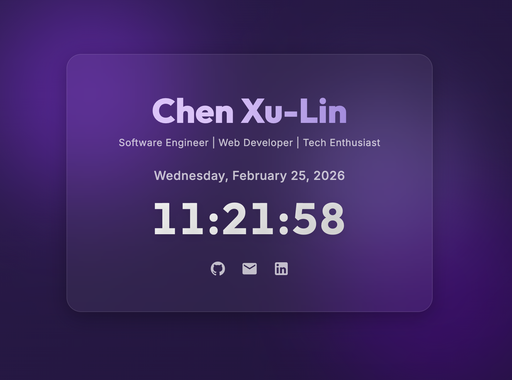

# Personal Webpage

A modern, interactive single-page personal website built with HTML, CSS, and JavaScript.

**🌐 Live Demo:** [https://charles8745.github.io/HW1_PersonalPage/](https://charles8745.github.io/HW1_PersonalPage/)

## Key Features

- **Modern Design:** Glassmorphism card, deep purple dynamic gradient background.
- **Interactive Parallax Effect:** Background orbs dynamically follow cursor movement.
- **Micro-Interactions:** Click ripple wave effect and interactive social media hover links.
- **Live Clock & Date:** Real-time updating display.
- **Smooth Animations:** Staggered load-in with an optimized display loading state.

## Technologies Used

- Vanilla HTML5
- Vanilla CSS3 (Custom Properties, Flexbox, Keyframe Animations)
- Vanilla JavaScript (DOM manipulation, Date API)

## Overview

For a detailed breakdown of the features implemented in this project, please see the [Project Summary](summary.md).

